# Tesi di Laurea Triennale

## Capitolo 1 - Definizioni e terminologia
Vengono date definizioni utili di Teoria dei Grafi e una serie di termini specifici
per poter meglio comprendere il resto della tesi.

Vengono anche mostrate una serie di caratteristiche
per poter definire e distinguere i vari tipi di labirinti.

## Capitolo 2 - Algoritmo A*
Viene brevemente presentato l'algoritmo risolutivo A*.

## Capitolo 3 - Algoritmi generativi
Vengono descritti i vari algoritmi che permettono di generare i labirinti. Per ogni algoritmo viene
analizzato lo pseudocodice, la complessità computazionale e spaziale e viene descritto
che tipo di labirinti permette di costruire.

## Capitolo 4 - Statistiche
Vengono analizzate una serie di proprietà per ogni algoritmo generativo basandosi su delle statistiche,
raccolte sui seguenti campioni:
- labirinti 100x100 su 1000 casi
- labirinti 200x200 su 1000 casi
- labirinti 500x500 su 500 casi

## Capitolo 5 - Conclusioni
Vengono tratte le conclusioni sul lavoro svolto.
Quindi viene deciso se ci sono o meno algoritmi oggettivamente migliori di altri oppure se alcuni algoritmi
sono più indicati di altri rispetto a particolari situazioni (restrizioni sul tempo di esecuzione,
sul tipo di labirinto generato ecc...).

Infine vengono discussi eventuali miglioramenti al progetto, come l'implementazione di algoritmi per la generazione
di labirinti di struttura diversa, oppure metodi di visualizzazione di altre caratteristiche/proprietà
rispetto ai soli percorsi e distanze.

 

# Bibliography

The sources that contributed the most to the development of this project are the following:

- **Jamis Buck** [(GitHub)](https://github.com/jamis): 
  - (Book) [Mazes for Programmers: Code your Own Twisty Little Passages](http://www.mazesforprogrammers.com/)
  - (Website) [The Buckblog](http://weblog.jamisbuck.org/)
  - (Website) [Maze generation algorithms recap](https://weblog.jamisbuck.org/2011/2/7/maze-generation-algorithm-recap.html)

- **Walter D. Pullen**:
  - (Website) [Astrolog: Maze classification](https://www.astrolog.org/labyrnth/algrithm.htm)
  - (Website) [Astrolog: Maze glossary](https://www.astrolog.org/labyrnth/glossary.htm)

- **Amit Patel**:
  - (Website) [A* notes](https://theory.stanford.edu/~amitp/GameProgramming/AStarComparison.html)
  - (Website) [A* notes (updated version)](https://www.redblobgames.com/pathfinding/a-star/introduction.html)

 

An interesting Master's Thesis about the subject can be found here: 
- [Automated Maze Generation and Human Interaction (2008), by Martin Foltin](https://theses.cz/id/k1d3n5/)
- or here [Automated Maze Generation and Human Interaction (2008), by Martin Foltin](https://is.muni.cz/th/xofma/thesis.pdf).

 

# Features

Every maze can be generated with a variety of options:

- **Background type**:
  - Full color
  - Checkerboard

- **Gradient**:
  - The gradient can be applied to the maze or only to the path showed.
  - The gradient is based on three colors.
  - The gradient is based on the distances calculated from a specific cell, which can be modified.

- **Path**:
  - The path showed can be the Solution Path, calculated with the A* algorithm, or the Longest Path in the maze.
  - The path can be shown as a gradient or as a colored line.

- **Distances**:
  - The distances can be shown above the cells.

 

Here is a list of all the configurable options:
- Color of the starting and goal cell.
- Colors of the gradient (start, middle, end).
- Smoothness exponent of the gradient.
- Color of the path.
- Color of the text.
- Color of the deadends.
- Color of the background (single color or checkerboard).
- Color of the walls.
- Thickness of the wall.
- Cell size.
- Maze dimension.

# Maze samples

## Binary Tree
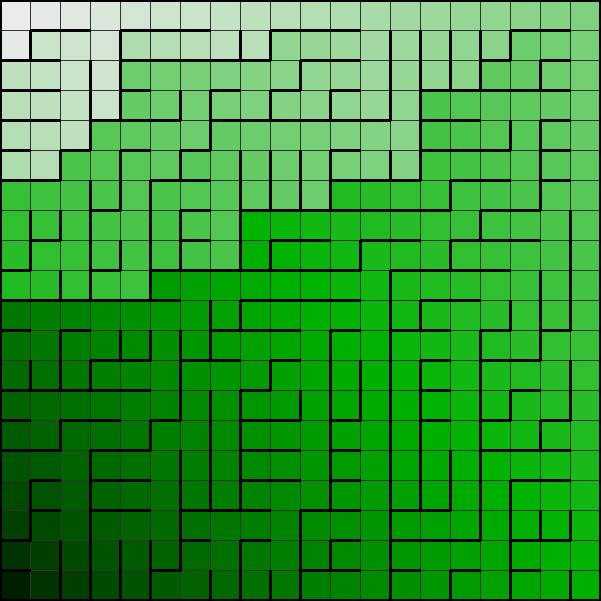

## Sidewinder
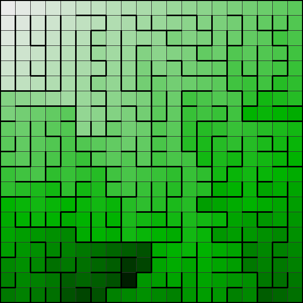

## Aldous-Broder
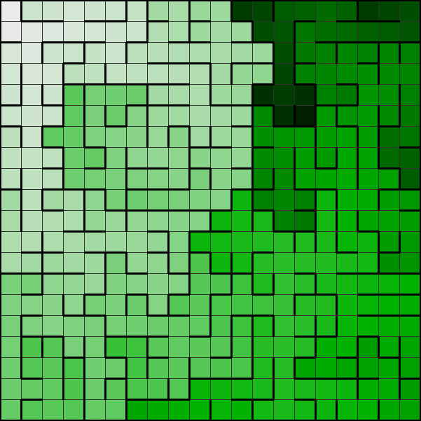

## Recursive Backtracker
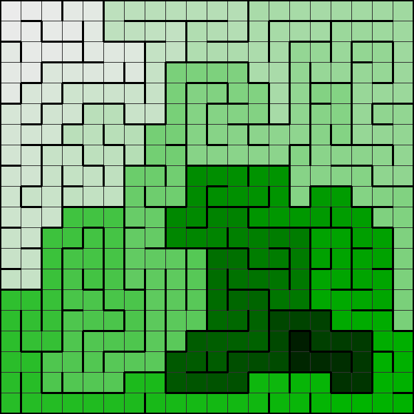

## Recursive Division
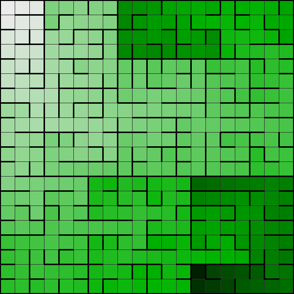

# Stats

Here are some statistics collected about the mazes.

## Generation time

### 100x100
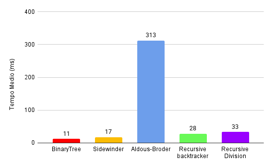

### 200x200
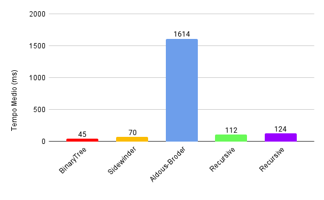

### 500x500
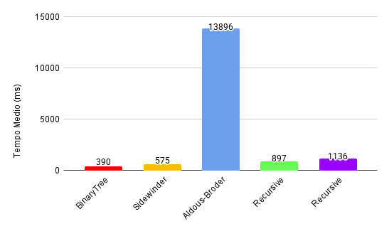

### Comparative
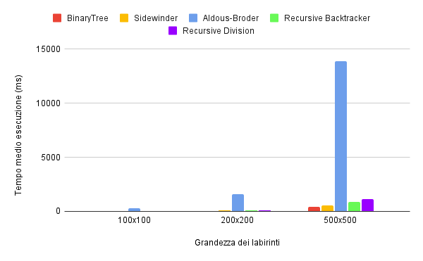

 

## Resolution time

### 100x100
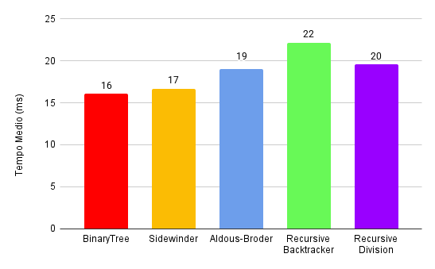

### 200x200
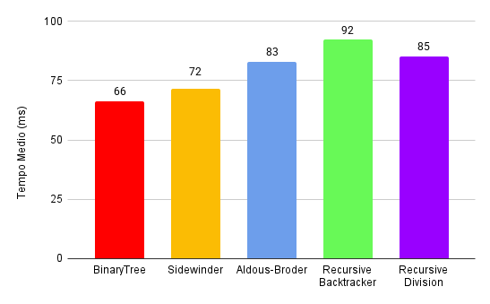

### 500x500
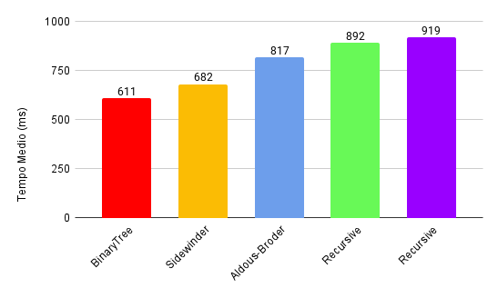

### Comparative
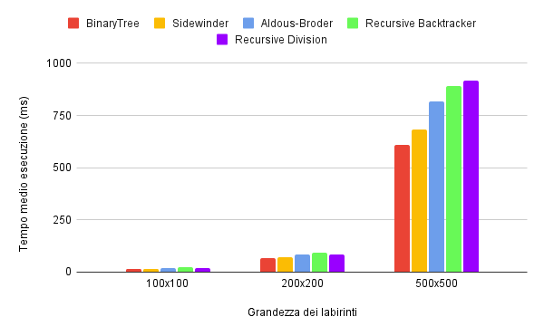

 

## Length of the solution

### 100x100
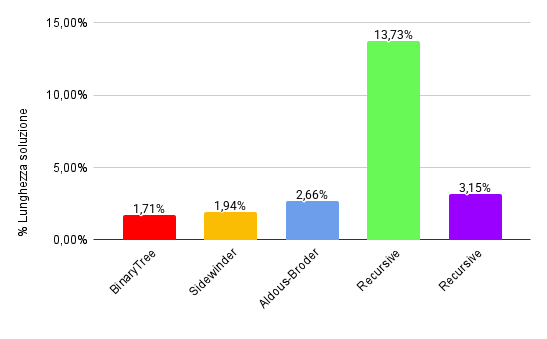

### 200x200
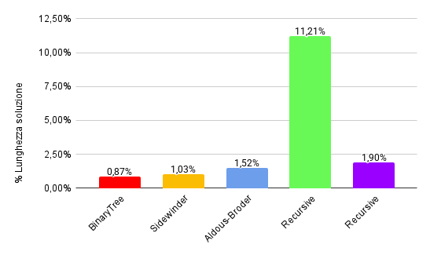

### 500x500
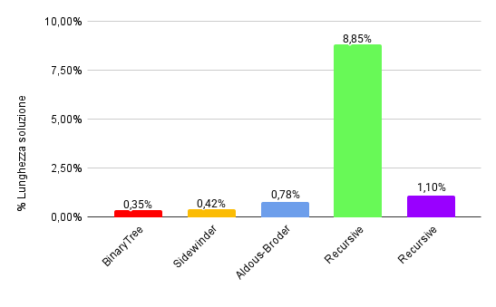

### Comparative
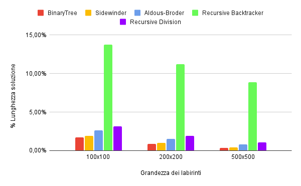

 

## Length of the longest path

### 100x100
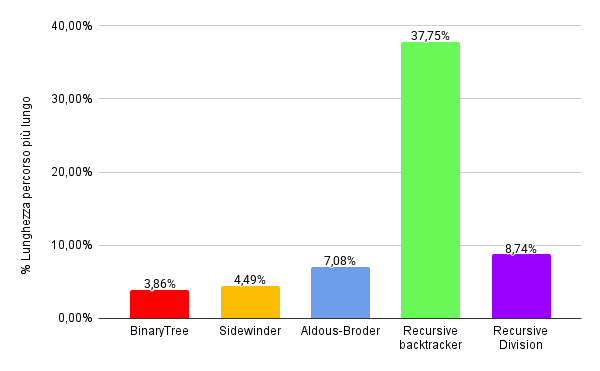

### 200x200
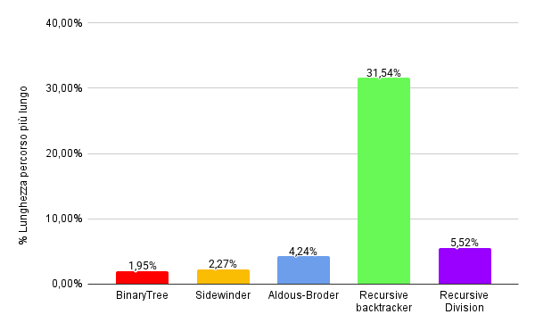

### 500x500
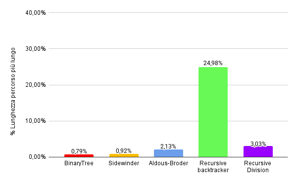

### Comparative
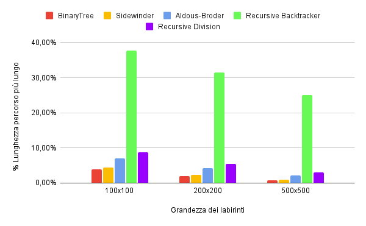

 

## Number of dead ends

### 100x100
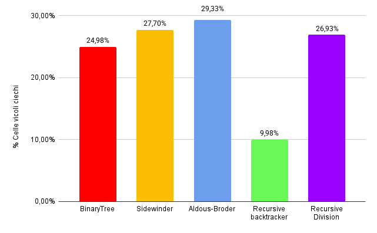

### 200x200
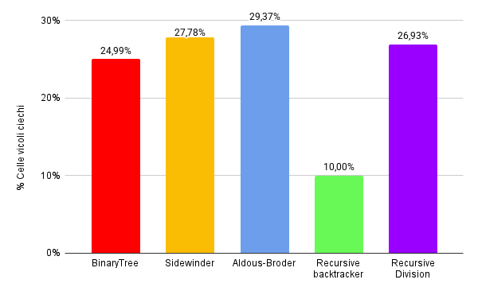

### 500x500
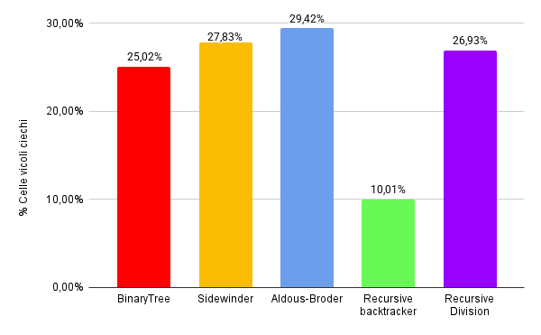

### Comparative
